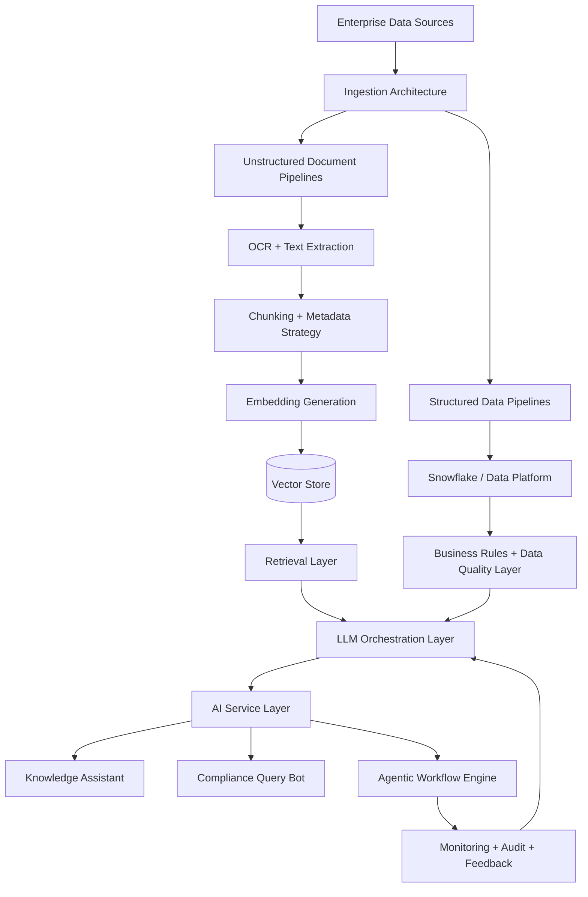
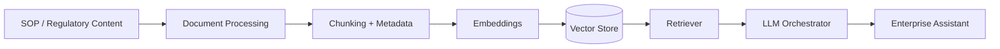
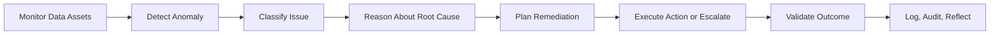
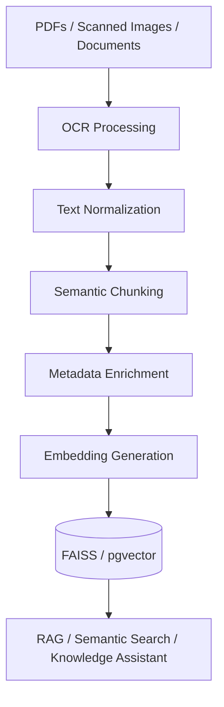

<h1 align="center">Dhanumjaya Saggurthi</h1>

  <b>AI Lead Architect · Enterprise GenAI · RAG Systems · Agentic AI · Cloud Data Architecture</b>

  I architect enterprise-grade Generative AI platforms, retrieval systems, agentic workflows,
  document intelligence solutions, and governed cloud data architectures for production environments.

  
  
  

---

## Architect Profile

I focus on defining, designing, and governing enterprise AI systems from architecture strategy through production execution.

My work centers on transforming complex business, compliance, and data problems into scalable AI and data platform architectures. I specialize in designing systems where Generative AI, retrieval, automation, cloud data platforms, and governance must work together reliably.

Core architecture areas:

- Enterprise Generative AI platforms
- Retrieval-Augmented Generation architecture
- Agentic AI workflow design
- Vector search and semantic retrieval strategy
- OCR and unstructured document intelligence
- Snowflake-centered cloud data architecture
- AI governance, auditability, and production-readiness
- Secure API and microservice-based AI deployment patterns

---

## Architecture Domains

| Domain | Architecture Focus |
|---|---|
| Enterprise GenAI | LLM platform design, assistant architecture, orchestration patterns, governance |
| RAG Systems | Retrieval design, chunking strategy, embeddings, vector stores, relevance tuning |
| Agentic AI | Planning-execution-reflection loops, autonomous workflows, human-in-the-loop controls |
| Document Intelligence | OCR architecture, PDF/image extraction, semantic indexing, knowledge ingestion |
| Cloud Data Platforms | Snowflake architecture, DBT models, Airflow orchestration, Spark/Kafka pipelines |
| AI Productionization | FastAPI services, secure deployment, observability, scalability, SLA alignment |
| Regulated Environments | Compliance-aware design, audit trails, access controls, data-quality governance |

---

## Enterprise AI Reference Architecture

---

## Signature Architecture Work

### Enterprise GenAI Knowledge Assistant

Architected an enterprise knowledge assistant for SOP and regulatory content access across a large internal user base.

**Architecture responsibilities**

- Defined end-to-end RAG architecture
- Designed embedding, chunking, and indexing strategy
- Established vector retrieval behavior using Pinecone and pgvector
- Designed FastAPI-based AI service layer
- Supported multi-tenant enterprise access patterns
- Optimized for sub-700ms response performance
- Designed for 3,000+ internal users

**Architecture pattern**

---

### Agentic Data Quality Architecture

Architected an AI-driven workflow engine for monitoring and remediating Snowflake data-quality issues.

**Architecture responsibilities**

- Designed planning-execution-reflection agent loop
- Integrated Snowflake monitoring with AI reasoning
- Defined anomaly detection and remediation flow
- Established validation and feedback loop
- Reduced manual triage effort by approximately 60%
- Supported SLA-driven enterprise reporting

**Agentic workflow pattern**

---

### OCR + Document Intelligence Architecture

Architected an unstructured document ingestion platform for scanned PDFs, images, and enterprise knowledge assets.

**Architecture responsibilities**

- Designed OCR-based ingestion pipeline
- Integrated Google Vision API for scanned document extraction
- Defined semantic chunking and metadata enrichment strategy
- Designed FAISS and pgvector-based retrieval layer
- Enabled downstream RAG, chatbot, and semantic search use cases

**Document intelligence pattern**

---

## Architecture Principles

I design AI and data systems around the following principles:

| Principle | Description |
|---|---|
| Production First | Architect for deployment, scale, monitoring, security, and maintainability from the beginning |
| Retrieval Quality | Treat retrieval design as a core architecture concern, not a secondary implementation detail |
| Governance by Design | Build auditability, access control, lineage, and compliance into the architecture |
| Human-in-the-Loop | Use controlled autonomy where AI systems can reason, recommend, escalate, and validate |
| Modular AI Services | Separate ingestion, retrieval, orchestration, evaluation, and service layers |
| Measurable Outcomes | Tie architecture decisions to latency, quality, cost, SLA, and user-impact metrics |
| Enterprise Fit | Align AI architecture with data platforms, business workflows, and compliance requirements |

---

## AI Architecture Stack

### Generative AI & Orchestration

`LLM Applications` · `RAG` · `Agentic AI` · `LangChain` · `OpenAI APIs` · `Hugging Face` · `Prompt Engineering` · `LLM Evaluation`

### Retrieval & Vector Architecture

`Pinecone` · `FAISS` · `pgvector` · `Semantic Search` · `Vector Databases` · `Embeddings` · `Hybrid Retrieval` · `Metadata Filtering`

### Document Intelligence

`OCR` · `Google Vision API` · `PDF Extraction` · `Image Text Extraction` · `Chunking Strategy` · `Document Embeddings`

### Cloud Data Architecture

`Snowflake` · `DBT` · `Airflow` · `StreamSets` · `Databricks` · `Apache Spark` · `Kafka` · `SQL`

### AI Service & Platform Layer

`Python` · `FastAPI` · `Microservices` · `GitHub Actions` · `AWS` · `GCP` · `Azure` · `Containerized Deployment`

### Analytics & Decision Intelligence

`Power BI` · `Tableau` · `Looker` · `Machine Learning` · `NLP` · `Forecasting` · `Statistical Modeling`

---

## Professional Highlights

- AI Lead Architect and Innovation Leader for enterprise GenAI initiatives
- Architected GenAI knowledge assistant used by 3,000+ internal users
- Designed RAG pipelines and vector-based knowledge stores for production workloads
- Architected agentic workflows for Snowflake data-quality remediation
- Reduced manual data-quality triage effort by approximately 60%
- Designed OCR-powered ingestion architecture for PDFs and scanned content
- SnowPro Core certified
- Recipient of Birlasoft Mercury Award for high-impact enterprise GenAI delivery

---

## Architecture Portfolio Direction

I use GitHub to document reusable architecture patterns for enterprise AI systems.

| Reference Architecture | Focus |
|---|---|
| `enterprise-rag-reference-architecture` | RAG platform design with retrieval, evaluation, APIs, and observability |
| `agentic-data-quality-architecture` | Agent-based Snowflake anomaly detection and remediation workflow |
| `document-intelligence-rag-platform` | OCR, PDF ingestion, vector indexing, and semantic retrieval |
| `genai-compliance-query-architecture` | Compliance-focused RAG assistant over structured and unstructured data |
| `cloud-ai-platform-blueprints` | Secure cloud-native patterns for enterprise AI deployment |

---

## Current Focus

- Enterprise GenAI platform architecture
- RAG quality, evaluation, and retrieval optimization
- Agentic AI workflows for data operations
- AI systems for regulated and compliance-heavy environments
- Snowflake-centered data and AI platform modernization
- Production-readiness, governance, and scalable AI service design

---

## GitHub Activity

  

  

  

---

## Contact

  
  

