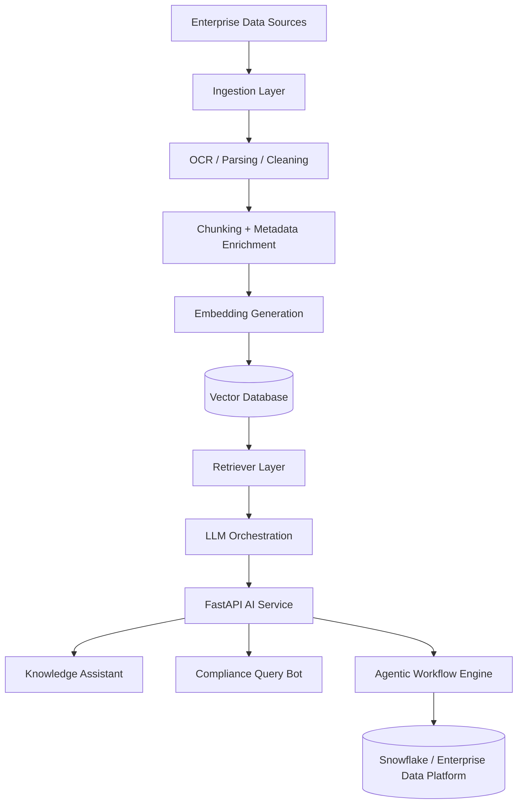
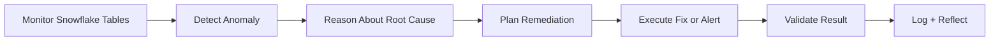

<h1 align="center">Dhanumjaya Saggurthi</h1>

  <b>AI Lead Architect · GenAI Systems · RAG · Agentic AI · Cloud Data Engineering</b>

  I architect and build enterprise-grade Generative AI platforms, retrieval-augmented generation systems,
  autonomous AI agents, document intelligence pipelines, and cloud-native data solutions.

  
  
  

---

## About Me

I am an AI Lead Architect and Data Engineer focused on building production-ready Generative AI and cloud data systems for enterprise environments.

My work spans:

- Enterprise Generative AI platforms
- Retrieval-Augmented Generation systems
- Agentic AI workflows
- Vector search and semantic retrieval
- OCR-powered document intelligence
- Snowflake-centered data platforms
- Real-time and batch data pipelines
- Secure, scalable AI service deployment

I have delivered GenAI assistants, compliance query bots, document ingestion engines, and AI-driven data-quality workflows in enterprise healthcare environments.

---

## Core Architecture Focus

---

## What I Build

| Area | Systems |
|---|---|
| Generative AI | Enterprise assistants, RAG platforms, compliance bots, LLM applications |
| Agentic AI | Planning-execution-reflection agents, autonomous data-quality workflows |
| Retrieval Systems | Vector search, embeddings, semantic search, hybrid retrieval |
| Document Intelligence | OCR pipelines, PDF extraction, scanned document processing |
| Data Engineering | Snowflake, DBT, Airflow, Spark, Kafka, StreamSets |
| Cloud AI | AWS, GCP, Azure, FastAPI, containerized AI services |

---

## Featured System Designs

### Enterprise GenAI Knowledge Assistant

Architected an LLM-powered knowledge assistant for SOP and regulatory content access across enterprise users.

**Architecture components**

- Llama-3 based assistant workflow
- LangChain orchestration
- Pinecone and pgvector retrieval layer
- FastAPI microservice backend
- Multi-tenant service architecture
- Sub-700ms response target
- Designed for 3,000+ internal users

---

### OCR + Unstructured Document Ingestion Platform

Designed an OCR-powered pipeline for processing scanned PDFs, documents, and unstructured enterprise content.

**Capabilities**

- PDF and image extraction
- Google Vision API OCR
- Text parsing and cleanup
- Semantic chunking
- Embedding generation
- FAISS / pgvector indexing
- RAG-ready document retrieval

---

### Agentic Data Quality Workflow Engine

Architected an AI agent loop to monitor, detect, and remediate data-quality issues in Snowflake.

**Impact**

- Reduced manual triage effort by approximately 60%
- Improved SLA adherence for enterprise reporting
- Combined Snowflake, AI reasoning, and workflow automation

---

## Technical Stack

### AI / LLM Engineering

### Vector Search / Retrieval

### Data Engineering

### Backend / Cloud

### Analytics / BI

---

## Professional Highlights

- AI Lead Architect and Innovation Leader for enterprise GenAI initiatives
- SnowPro Core certified
- Recipient of Birlasoft Mercury Award for high-impact delivery
- Architected RAG systems and vector-based knowledge platforms
- Designed OCR-powered document ingestion pipelines
- Built agentic workflows for Snowflake data-quality automation
- Led technical direction for cross-functional engineering teams

---

## Recommended Public Portfolio Repositories

These are the types of repositories I am building to demonstrate production-grade AI architecture patterns:

| Repository | Description |
|---|---|
| `enterprise-rag-reference-architecture` | End-to-end RAG system using FastAPI, LangChain, pgvector, evaluation, and observability |
| `agentic-data-quality-engine` | AI agent workflow for Snowflake anomaly detection and remediation |
| `document-intelligence-ocr-rag` | OCR + PDF ingestion + embedding + vector retrieval pipeline |
| `genai-compliance-query-bot` | RAG-based regulatory and compliance query assistant |
| `snowflake-ai-observability` | Data-quality metrics, diagnostics, alerts, and AI-generated issue summaries |

---

## Current Focus

- Production-grade Generative AI systems
- Enterprise RAG architecture and retrieval optimization
- Agentic AI for data operations
- Document intelligence and semantic search
- Secure AI systems for regulated industries
- Cloud-native data and AI platforms

---

## GitHub Stats

  

  

  

---

## Contact

  
  

