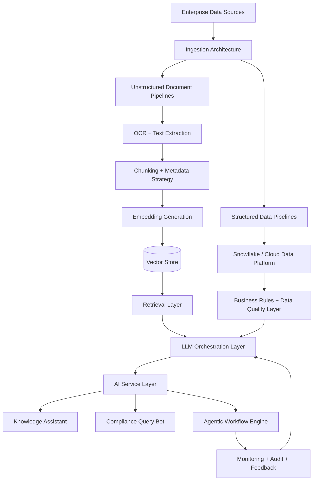
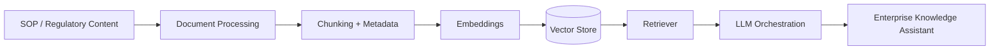
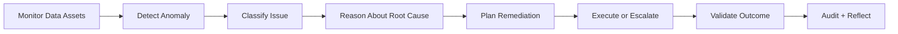
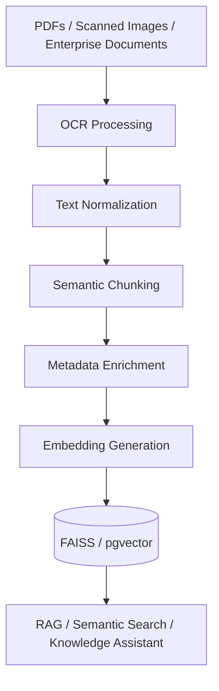
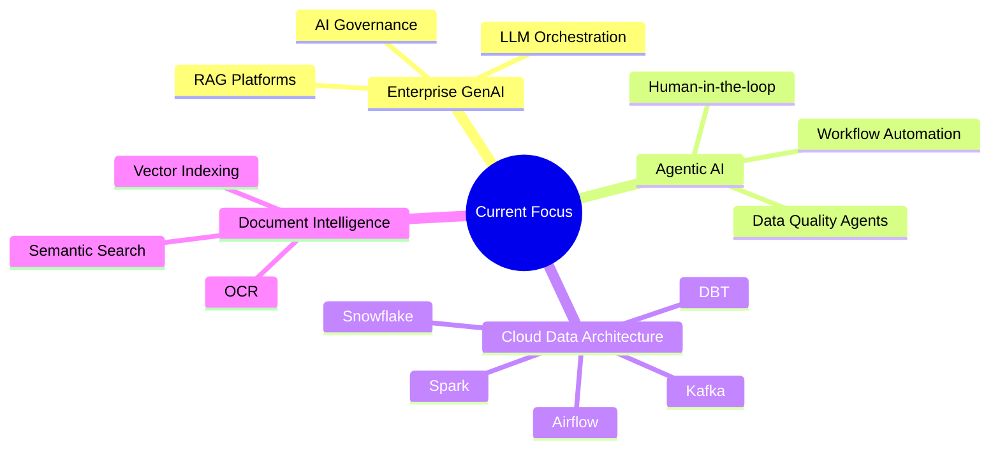

<!--
Profile README for Dhanumjaya Saggurthi
Focus: AI Lead Architect | Enterprise GenAI | RAG | Agentic AI | Cloud Data Architecture
-->

  

---

## 🧠 Architect Profile

I am an **AI Lead Architect** focused on designing enterprise-grade Generative AI systems, RAG platforms, agentic workflows, document intelligence solutions, and cloud-native data architectures.

My work sits at the intersection of:

- 🧩 **Enterprise AI strategy**
- 🔎 **Retrieval and semantic search architecture**
- 🤖 **Agentic AI workflow design**
- 📄 **OCR and unstructured document intelligence**
- ❄️ **Snowflake-centered cloud data platforms**
- 🔐 **Governed, scalable, production-ready AI systems**

I enjoy turning ambiguous business and compliance problems into clean, scalable AI architectures that teams can actually build, operate, and trust.

---

## 🌈 Architecture Identity

<table>
<tr>
<td width="50%">

### 🏗️ What I Architect

- Enterprise GenAI platforms  
- RAG-based knowledge systems  
- Agentic AI workflows  
- Vector search platforms  
- OCR document intelligence pipelines  
- Cloud data platforms  
- Secure AI service layers  
- AI governance and auditability patterns  

</td>
<td width="50%">

### 🎯 My Architecture Lens

- Production-first design  
- Retrieval quality over prompt tricks  
- Governance by design  
- Human-in-the-loop controls  
- Modular AI services  
- Measurable business impact  
- Enterprise security alignment  
- Scalable cloud-native patterns  

</td>
</tr>
</table>

---

## 🚀 Enterprise AI Reference Architecture

---

## ✨ Signature Architecture Work

<table>
<tr>
<td>

## 🟦 Enterprise GenAI Knowledge Assistant

Architected a production-oriented knowledge assistant for SOP and regulatory content access across enterprise users.

**Architecture focus**

- End-to-end RAG design  
- Embedding and chunking strategy  
- Vector retrieval using Pinecone and pgvector  
- FastAPI-based AI service layer  
- Multi-tenant access pattern  
- Sub-700ms response target  
- Designed for 3,000+ internal users  

</td>
</tr>
</table>

---

<table>
<tr>
<td>

## 🟩 Agentic Data Quality Architecture

Architected an AI-driven workflow engine for monitoring, reasoning over, and remediating Snowflake data-quality issues.

**Architecture focus**

- Planning-execution-reflection agent loop  
- Snowflake monitoring integration  
- AI-assisted anomaly reasoning  
- Remediation planning  
- Validation and feedback loop  
- Approximately 60% reduction in manual triage effort  
- SLA-driven reporting support  

</td>
</tr>
</table>

---

<table>
<tr>
<td>

## 🟨 OCR + Document Intelligence Architecture

Architected an unstructured document ingestion platform for scanned PDFs, images, and enterprise knowledge assets.

**Architecture focus**

- OCR-based ingestion pipeline  
- Google Vision API integration  
- PDF and scanned image extraction  
- Semantic chunking  
- Metadata enrichment  
- FAISS and pgvector indexing  
- RAG-ready knowledge access  

</td>
</tr>
</table>

---

## 🧭 Architecture Domains

| Domain | Architecture Focus |
|---|---|
| 🧠 Enterprise GenAI | LLM platform design, assistant architecture, orchestration, governance |
| 🔎 RAG Systems | Retrieval design, chunking strategy, embeddings, vector stores, relevance tuning |
| 🤖 Agentic AI | Planning-execution-reflection loops, autonomous workflows, human oversight |
| 📄 Document Intelligence | OCR architecture, PDF/image extraction, semantic indexing, knowledge ingestion |
| ❄️ Cloud Data Platforms | Snowflake architecture, DBT models, Airflow orchestration, Spark/Kafka pipelines |
| 🔐 AI Productionization | Secure APIs, microservices, observability, access control, SLA alignment |
| 🏛️ Regulated Environments | Auditability, governance, compliance-aware data and AI design |

---

## 🛠️ Architecture Stack

### 🧠 GenAI, LLMs & Orchestration

  
  
  
  
  

### 🔎 Vector Search & Retrieval

  
  
  
  

### ❄️ Cloud Data Architecture

  
  
  
  
  

### ☁️ Cloud, APIs & Platform Layer

  
  
  
  
  

---

## 🏆 Professional Highlights

- 🧠 AI Lead Architect and Innovation Leader for enterprise GenAI initiatives  
- 🚀 Architected GenAI knowledge assistant designed for 3,000+ internal users  
- 🔎 Designed production RAG pipelines and vector-based knowledge stores  
- 🤖 Architected agentic workflows for Snowflake data-quality remediation  
- 📉 Reduced manual data-quality triage effort by approximately 60%  
- 📄 Designed OCR-powered ingestion architecture for PDFs and scanned documents  
- ❄️ SnowPro Core certified  
- 🏅 Recipient of Birlasoft Mercury Award for high-impact delivery  

---

## 📚 Architecture Portfolio Direction

I use GitHub to document reusable architecture patterns for enterprise AI systems.

| Reference Architecture | Purpose |
|---|---|
| `enterprise-rag-reference-architecture` | RAG platform blueprint with retrieval, APIs, evaluation, and observability |
| `agentic-data-quality-architecture` | Agent-based Snowflake anomaly detection and remediation workflow |
| `document-intelligence-rag-platform` | OCR, PDF ingestion, vector indexing, and semantic retrieval |
| `genai-compliance-query-architecture` | Compliance-focused RAG assistant over structured and unstructured data |
| `cloud-ai-platform-blueprints` | Secure cloud-native architecture patterns for enterprise AI deployment |

---

## 🌱 Current Focus

---

## 📊 GitHub Activity

  

  

  

---

## 🤝 Let’s Connect

  
  

  

